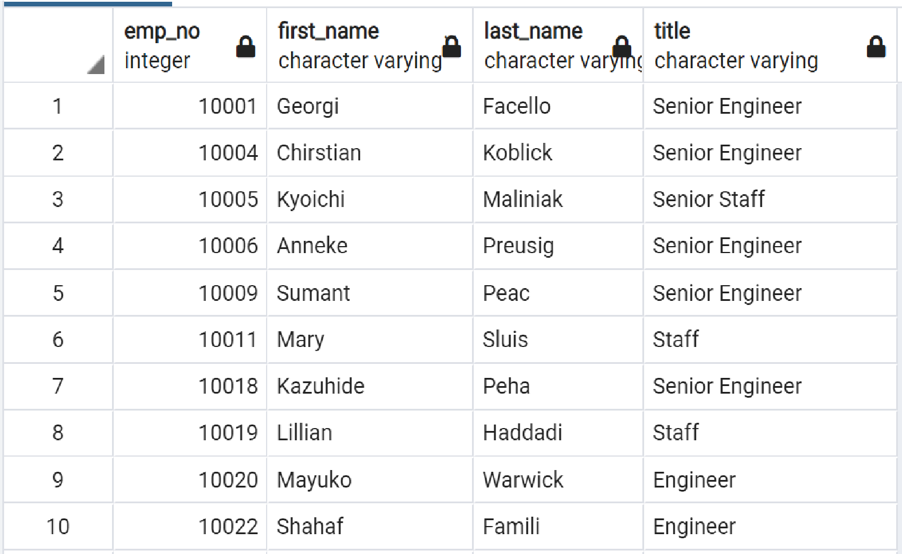

# Pewlett-Hackard-Analysis

   

## Table of Contents
* [Overview of Analysis](https://github.com/rkaysen63/Pewlett-Hackard-Analysis/blob/master/README.md#overview-of-analysis)
* [Resources](https://github.com/rkaysen63/Pewlett-Hackard-Analysis/blob/master/README.md#resources)
* [Results](https://github.com/rkaysen63/Pewlett-Hackard-Analysis/blob/master/README.md#results)
* [Summary](https://github.com/rkaysen63/Pewlett-Hackard-Analysis/blob/master/README.md#summary)

## Overview of Analysis
Pewlett Hackard (P-H) has a large number of Baby Boomers on the verge of retirement.  In order to prepare for the “silver-tsunami” departing the company, the research department had to determine who would be retiring in a few years and how many positions would need to be filled.  In addition, the research department had to identify current employees that qualified for the mentorship program in order to determine if there would be enough qualified retirement-ready employees to mentor the next generation.

## Resources
* Data Sources:
  * departments.csv
  * dept_emp.csv
  * dept_manager.csv
  * employees.csv
  * salaries.csv
  * titles.csv
* Database Management System:  PostgreSQL
* Development Platform:  pgAdmin
* Lesson Plan: UTA-VIRT-DATA-PT-02-2021-U-B-TTH, Module 7 Challenge
* ERD design:  www.quickdatabasediagrams.com

## Results  

### Entity Relationship Diagram and Creating the Database
Prior to setting up the database, an Entity Relationship Diagram (ERD) was created on www.quickdatabasediagrams.com.  The [ERD](https://github.com/rkaysen63/Pewlett-Hackard-Analysis/blob/master/README.md#Pewlett-Hackard-Analysis) is used to visualize the relationships between the data sources.  

The database was created from six Comma Separated Values files.  These files are listed in the [Resources](https://github.com/rkaysen63/Pewlett-Hackard-Analysis/blob/master/README.md#resources).  Using the ERD as a guide, the six CSV files were imported and relationships established between tables to create the database.  The following is an example of the code required to import one of the CSV files.  The code includes the name of the table *dept_emp* and lists all of the columns and their data types.  In addition, the code identifies the primary key(s) and any foreign key(s) with their relationship(s) other tables. See [Schema](https://github.com/rkaysen63/Pewlett-Hackard-Analysis/blob/main/Queries/schema.sql). 

    CREATE TABLE dept_emp (
      emp_no INT NOT NULL,
      dept_no VARCHAR(4) NOT NULL,
      from_date DATE NOT NULL,
      to_date DATE NOT NULL,
      FOREIGN KEY (emp_no) REFERENCES employees (emp_no),
      FOREIGN KEY (dept_no) REFERENCES departments (dept_no),
      PRIMARY KEY (emp_no, dept_no));  

### Queries

* **Retirement Titles Query**  
  The Retirement Titles Query returns each employee’s unique id (`emp_no`), `first_name`, and `last_name` from the table, *employees*, and pulls employee titles (`title`) and date range of title (`from_date`, `to_date`) from the job titles table, *titles*, by an `INNER JOIN` that returns records that have matches between the *employees* and *title* tables.  The tables are joined `ON` the employee unique i.d. (`emp_no`) and the new columns are added `INTO` a new table called *retirement_titles*.  The data is filtered with a `WHERE (e.birth_date BETWEEN '1952-01-01' AND '1955-12-31')` to include only employees who were born in 1965. And finally, ordered by the emp_no in ascending order, which is the default order.  Aliases were used, e.g. `employees AS e`, to reduce misspellings, reduce keystrokes and to produce a cleaner looking code. 

    SELECT e.emp_no, 
     e.first_name,  
     e.last_name,
     t.title,
     t.from_date,
     t.to_date
    INTO retirement_titles
    FROM employees as e
    INNER JOIN titles as t
      ON (e.emp_no = t.emp_no)
    WHERE (e.birth_date BETWEEN '1952-01-01' AND '1955-12-31')
    ORDER BY e.emp_no;  

   

  

  Note, some employee names occur more than once indicating that they have held more than one title during their tenure with P-H.  
  
*	**Unique Titles Query**  
  The Unique Titles Query returns `emp_no`,`first_name`, `last_name` and `title` as in *retirement_titles*, but it removes any duplicate titles so that each employee appears only once on the resulting table, *unique_titles*, with their current title.   The `SELECT DISTINCT ON` expression was used on `emp_no` to return the unique id `emp_no` just once from the *retirement_titles* table.  `SELECT DISTINCT ON` will keep the first row of `emp_no` and ignore the duplicates.  To ensure that the first row that is kept is the desired row, `SELECT DISTINCT ON` is used in conjunction with the `ORDER BY` clause.  Since the most recent `to_date` is desired, the results requested were ordered by `emp_no` and `to_date` with `to_date` in descending `DESC` order so that the row with the most recent `to_date` would be first. 

    SELECT DISTINCT ON (emp_no) emp_no, 
      first_name, 
      last_name,
      title
    INTO unique_titles
    FROM retirement_titles
    ORDER BY emp_no, to_date DESC;  

  

     
  
  

* Compare the size of the two tables *retirement_titles* and *unique_titles*.  

      -- count size of retirement_titles
      SELECT COUNT (emp_no)
      FROM retirement_titles;  
            
  * A count of `emp_no` on *retirement_titles* returns 133,776.  
  
        -- count size of unique_titles  
        SELECT COUNT (emp_no)  
        FROM unique_titles;  
      
  * A count of `emp_no` on *unique_titles* returns 90,398.  *unique_titles* is approximately two-thirds the size of *retirement_titles* because each employee is only listed once.

* **Retiring Titles Query**  
  The Retiring Titles Query returns a table of seven job titles, i.e. roles, and number of employees who hold that title.  These numbers were queried from the database table *unique_titles* using the `COUNT()` function on `title` in conjunction with the `GROUP BY` clause on `title` to group the data by job title and return the number of times that title appears in *unique_titles*. The results were ordered by the “count” column in descending order.  However, the results do not show the breakdown of these roles by department.  
  
      SELECT   
        COUNT (title) as "count",  
        title  
      INTO retiring_titles  
      FROM unique_titles  
      GROUP BY title  
      ORDER BY "count" DESC;    
  

   

  
  
* **Mentorship Eligibility Query**  
  Employees born in the year 1965, i.e. employees that are 10 to 13 years younger than the retiring group, are eligible for the mentorship program that will prepare them to move into the roles currently occupied by the retiring group.  The query returns `emp_no`, `first_name`, `last_name`, and `birth_date` from the *employees* table, `from_date` and to_date` from the *dept_emp* table, and `title` from the *titles* table by a double `JOIN` and the results are written `INTO` a new table called *mentorship_eligibility*.  The double `JOIN` consists of an `INNER JOIN` of *employees* and *dept_emp* tables `ON` the key `emp_no` and a second ‘INNER JOIN` with *titles* again `ON` THE `emp_no` key.  The `INNER JOIN` will only include data that matches between the tables.  The results are filtered by `WHERE` and `AND` clauses, so that the returned result only includes employees who were born in 1965 **and** are currently working for P-H.  In order to return the emp_no once, the `SELECT DISTINCT ON` clause is used in conjunction with the `ORDER BY` clause.  `SELECT DISTINCT ON (e.emp_no)` pulls the emp_no one time from *employees* (“e” is alias for “employees”). `ORDER BY e.emp_no, t.to_date DESC` ensures that the results returned will be in order by the *employees* emp_no and arranges ‘t.to_date’ (“t” is alias for “ti) in descending order, i.e. most recent date first, so that `SELECT DISTINCT ON` keeps the row that has the most recent date.    
   
      SELECT DISTINCT ON (e.emp_no) e.emp_no,  
        e.first_name,  
        e.last_name,  
        e.birth_date,  
        de.from_date,  
        de.to_date,  
        t.title  
      INTO mentorship_eligibility  
      FROM employees AS e  
      INNER JOIN dept_emp AS de  
        ON e.emp_no = de.emp_no  
      INNER JOIN titles as t  
        ON e.emp_no = t.emp_no  
      WHERE (e.birth_date BETWEEN '1965-01-01' AND '1965-12-31')  
      AND (de.to_date = '9999-01-01')  
      ORDER BY e.emp_no, t.to_date DESC;    

  

     
  
  
  
  * The total number of employees eligible for the mentorship program, 1549, was determined by a query using the COUNT() function.  
    
        SELECT COUNT(emp_no)   
        FROM mentorship_eligibility;   

## Summary
The results yielded good information.  One query returns a table, *unique_titles*, of current employees nearing retirement age with their latest job title and then another query counted a whopping 90,398 employees nearing retirement in *unique_titles*.   A query saved as “retiring_tiles.csv” grouped and counted `title` in *unique_titles* in order to see how many of roles were retiring.  And finally, a query saved as “mentorship_eligibility.csv” created a table of employees, including present job title, that are eligible to receive mentoring in order to move to the next level.  
  
While the results were informative, still more research was required to determine how many roles will need to be filled as the "silver tsunami" begins to make an impact and whether or not there are enough qualified, retirement-ready employees in the departments to mentor the next generation of Pewlett Hackard employees.  
  
1)	How many roles will need to be filled as the “silver tsunami” begins to make an impact?  
  While we did create of table of how many roles were retiring, *retiring_titles*, it did not provide a break-down by department.  A table of the number of retiring titles by department, *rtrng_dept_title_count* was created by first creating a temporary table *unique_dept* to add the departments to the *mentorship_eligibility* table.  *unique_dept* was created by a double `INNER JOIN` of *unique_titles* and *dept_emp* `ON` the key `emp_no` and `INNER JOIN` of *dept_emp* and *departments* `ON` the key `dept_no` in order to pull matching data for desired columns. The columns in the temporary table *unique_dept* include `emp_no`, `first_name`, `last_name` and `title` from *unique_title* (“ut” is alias for “unique_title”) and `dept_name` from *departments* (“d” is alias for “departments”).  Again, `SELECT DISTINCT ON` in conjunction with `ORDER BY` with `emp_no` and `to_date` in descending order ensured that  *unique_dept* had single entries for each employee id, `emp_no`, and the employees current `title` by ordering the most recent `to_date` first.    
  
      SELECT DISTINCT ON (ut.emp_no) ut.emp_no,  
        ut.first_name,   
        ut.last_name,  
        ut.title,  
        d.dept_name  
      INTO unique_dept  
      FROM unique_titles AS ut  
      INNER JOIN dept_emp AS de  
        ON (ut.emp_no=de.emp_no)  
      INNER JOIN departments AS d  
        ON (de.dept_no=d.dept_no)  
      ORDER BY ut.emp_no, de.to_date;  
      
   Then a second query to `GROUP BY` `dept_name AS “Department”` and `title AS “Title”` counted the total number of each title `COUNT(title) AS “Total”` by the “Department” grouping.  See [rtrng_dept_title_count.csv](https://github.com/rkaysen63/Pewlett-Hackard-Analysis/blob/main/Data/rtrng_dept_title_count.csv).  
       
    SELECT dept_name As "Department", 
      title AS "Title", COUNT(title) AS "Total"
    INTO rtrng_dept_title_count
    FROM unique_dept
    GROUP BY dept_name, title
    ORDER BY "Department", "Title";

  

     
  
  
  
   When considering retiring roles by department, instead of 7 retiring roles, there are 26 different retiring roles of the 90,398 retiring employees.

2)	Are there enough qualified, retirement-ready employees in the departments to mentor the next generation of Pewlett-Hackard employees? 
  There are more than enough retirement-ready employees in the departments to mentor the next generation of P-H employees. The more important question for P-H is, who will fill the void when the “silver tsunami” retires?  P-H will be losing nearly 90,400 employees to retirement, including 2 of their managers, but there are only 1549 employees that may be ready to move into those roles.  
  
  The table counting the number of titles by department of mentorship eligible employees, *mnt_dept_titl_count*, was arrived at in much the same way as the *rtrng_dept_title_count*.  A temporary table, *mntrship_elig_dept* was created from a double `INNER JOIN` with unique emp_no with the current job title using `SELECT DISTINCT ON` and `ORDER BY` clauses.  

    SELECT DISTINCT ON (me.emp_no) me.emp_no,  
      me.first_name,  
      me.last_name,  
      me.title,  
      d.dept_name  
    INTO mntrshp_elig_dept  
    FROM mentorship_eligibility AS me  
    INNER JOIN dept_emp AS de  
      ON (me.emp_no=de.emp_no)  
    INNER JOIN departments AS d  
      ON (de.dept_no=d.dept_no)  
    ORDER BY me.emp_no, de.to_date;  
  
  The desired end result, *mnt_dept_title_count* was created from *mntrshp_elig_dept* using the `COUNT()` function, `GROUP BY` and `ORDER BY` clauses.  

    SELECT dept_name As "Department", 
      title AS "Title", COUNT(title) AS "Total"
    INTO mnt_dept_title_count
    FROM mntrshp_elig_dept
    GROUP BY dept_name, title
    ORDER BY "Department", "Title";
  
  The two tables *rtrng_dept_title_count* and * mnt_dept_title_count* were placed side by side for comparison.  Clearly there are enough Baby Boomers to mentor the next generation but not enough of the next generation to fill the roles they leave behind.  There’s approximately 1 employee in the mentorship program for every 50 that will be retiring.
  
  

     
  

[Back to the Table of Contents](https://github.com/rkaysen63/Pewlett-Hackard-Analysis/blob/master/README.md#table-of-contents)
